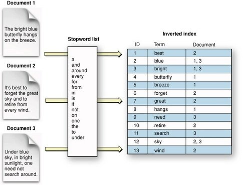
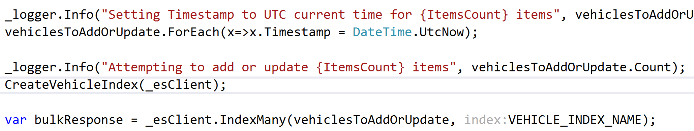

# Stretching .NET

#### An Introduction to ElasticSearch

[elasticsearch.seankilleen.com](https://elasticsearch.seankilleen.com)

---

# Some Love

---

<!-- _footer: "" -->

# <!--fit--> Hi! :wave: I'm Sean

- :bird: [sjkilleen](https://twitter.com/sjkilleen)
- :earth_americas: [SeanKilleen.com](https://seankilleen.com)
- :briefcase: [Excella](https://excella.com)

---

# Let's Find a Car

---
<!-- _footer: "" -->

---
<!-- _footer: "" -->

---
<!-- _footer: "" -->

---
<!-- _footer: "" -->

---
<!-- _footer: "" -->

---
<!-- _footer: "" -->

---
<!-- _footer: "" -->

---

---

---

# The Traditional Approach

---
<!-- _footer: "" -->

---
<!-- _footer: "" -->

---

# Enter ElasticSearch

---

---

# &lt; 300 ms

---
<!-- _footer: "" -->

---

#### Our Walkthrough

## Why elasticsearch

---

#### What we'll cover

## Concept Walkthrough

---

#### How is ES Different?

## Document DB

---
<!-- _footer: "" -->

---

#### How is ES Different?

## Inverted Index

---
<!-- _footer: "" -->

<!-- Image credit: https://www.quora.com/What-is-inverted-index-It-is-a-well-known-fact-that-you-need-to-build-indexes-to-implement-efficient-searches-What-is-the-difference-between-index-and-inverted-index-and-how-does-one-build-inverted-index -->

---

#### How is ES Different?

## Scalability

---
<!-- _footer: "" -->

---

## Think about the data

## ...like, a lot

---

## Creating the Index

---

---

---

---

---

#### Concept Review

# Node

---

#### Concept Review

# Index

---

#### Concept Review

# Type

---

#### Concept Review

# Mapping

---

#### Concept Review

# Multi-fields

---

#### Concept Review

# Analyzers

---

#### Analyzer Pipeline

- Input ("`Hello THERE, world!`")
- Character Filters ("`hello there world`")
- Tokenizer (`[hello, there, world]`)
- Token Filters (`[hello, world]`)
- Output

---

#### Concept Review

# Nest :heart: Lambdas

---

# Adding Data

---

---

---

---

#### Concept Review

# Surface Data Correctly

---

#### Concept Review

# Indexing

---

# Retrieving

---

---

---

---

---

---

#### Concept Review

# Query

---

#### Concept Review

# Filters

---

#### Concept Review

# Aggregation

---

# Searching

---

---

---

---

---
<!-- _footer: "" -->

---

---

---

---

#### Concept Review

# Paths

---

#### Concept Review

# Boolean Filters

---

#### Concept Review

# Encapsulating NEST

---

# What-if searches

---

---

#### Concept Review

# Cheap Searches == Opportunity

---

### So much more

- Clustering
- Logstash (operations)
- Kibana (visualization)
- X Pack (security, monitoring, ML)
- Beats (shippers)

---

<!-- _footer: "" -->

# <!--fit--> Thanks

- :bird: [sjkilleen](https://twitter.com/sjkilleen)
- :earth_americas: [SeanKilleen.com](https://seankilleen.com)
- :briefcase: [Excella](https://excella.com)
